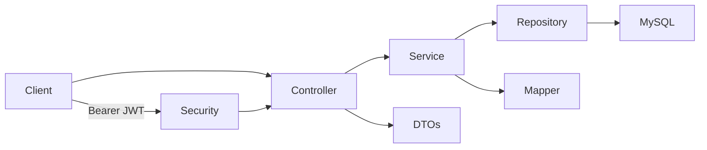

# Blog Management REST API

A production-oriented Java 21 / Spring Boot API for a secure multi-user blogging platform. It uses a layered design, stateless JWT authentication, role-based authorization, MySQL persistence, OpenAPI documentation, Docker, and a GitHub Actions build.

## Features

- Registration and BCrypt password storage; JWT login
- Roles: `USER`, `AUTHOR`, `ADMIN`; admin category moderation and owner/admin content moderation
- Paginated, sortable post feed, category filtering, and title/content search
- Posts, categories, nested comments, and profile/password management
- Validation and a consistent JSON error contract
- Swagger UI at `/swagger-ui/index.html`

## Architecture



## Data model

`users 1--* posts`, `users 1--* comments`, `categories 1--* posts`, `posts 1--* comments`, and `comments 1--* comments` for replies. JPA constraints enforce unique email, username, category name, and post slug.

## API

| Area | Endpoints |
|---|---|
| Auth | `POST /api/auth/register`, `POST /api/auth/login` |
| Posts | `POST/GET /api/posts`, `GET/PUT/DELETE /api/posts/{id}`, `GET /api/posts/search` |
| Categories | `POST/GET /api/categories`, `GET/PUT/DELETE /api/categories/{id}` |
| Comments | `POST/GET /api/posts/{postId}/comments`, `DELETE /api/comments/{id}` |
| Profile | `GET/PUT /api/users/profile` |

Add `Authorization: Bearer <token>` after login. Registration creates `USER` accounts; promote trusted authors/admins through an operational migration or administration workflow.

## Run locally

Prerequisites: Java 21, Maven 3.9+, and MySQL 8.

```bash
set DB_URL=jdbc:mysql://localhost:3306/blog_db?createDatabaseIfNotExist=true
set DB_USERNAME=blog_user
set DB_PASSWORD=blog_password
set JWT_SECRET=replace-with-a-random-secret-at-least-32-bytes-long
mvn spring-boot:run
```

The application listens on `http://localhost:8080`. For production, set `DDL_AUTO=validate` and use database migrations (Flyway/Liquibase).

## Docker

```bash
mvn package
set JWT_SECRET=replace-with-a-random-secret-at-least-32-bytes-long
docker compose up --build
```

## Testing and CI

```bash
mvn verify
```

JaCoCo generates a coverage report at `target/site/jacoco/index.html`. GitHub Actions runs `mvn -B verify` on pushes and pull requests using Java 21.

## Future improvements

- Flyway migrations and seed/admin bootstrap policy
- Refresh-token rotation, revocation, rate limiting, and audit trails
- Image upload service, email verification, and post publication workflows
- Testcontainers integration tests and branch coverage gates
